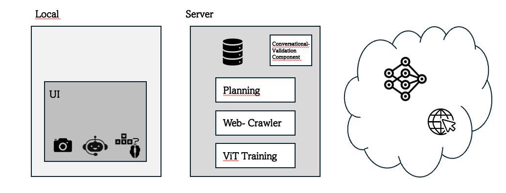
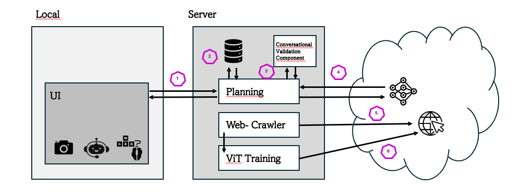

# A2C2 - Natural Language-Intructed Autonomous Agent for Computer Control

This repository is for 👨‍💻 developing / 🛠️ constructing / 🧪 testing and 🚀 moonshoting ideas for our bachelor thesis: **Natural Language-Intructed Autonomous Agent for Computer Control (A2C2)**

As part of module **Machine Learning Operations**, we developed a prototype of an **A2C2** and integrated several tools that we learnt about in the module to represent the development of our prototype in an ML pipeline. 

## Motivation
<h3>
 Why do we need an A2C2  
</h3>

* The **ultimate** AI application
* Assistant in using computer systems
* Helpful in everyday task 

<h3>
 Current challenges on the way to an A2C2  
</h3>

* Data Generation - *How and where to collect training data?* -
* Dynamic Action Inference - *How can the actions relevant for the instruction be determined?* -
* Refinement with the User - *Where does it require further information from the user?* -
* User Interaction for Critical Tasks - *When are further enquiries to the user necessary?* -

## Goal
* User friendly Chatbot
* Critical Task Detection
* Missing Information Detection
* Basic Pipeline for ViT Training

## Components

### UI
* Screen Captioning
* Chatbot
* I/O Execution

### Data Storage
* Storing Experience Embeddings

### Planning
* Task Decomposition & Refinement

### Web-Crawler
* Gathering real-life Data

### ViT Training
* Model Fine-Tuning

### Conversational Validation Component
* Critical Task Detection
* Missing Information Detection

### LLM & VLM

### Browser

## Components & ML- Tools

1. **UI interacts with planning component through REST**
    * UI with <strong>Tkinter</strong>, <strong>Python</strong> & <strong>pyautogui</strong>
    * Interaction through REST with <strong>FastAPI</strong>

2. **Planning Ccomponent does RAG for gathering more information**
    * Data storage (<em>decomposition prompts & planning prompts</em>) with <strong>oxen.ai</strong>

3. **Conversational - validator checks if critical action or missing information**
    * MAD (<em>multi-agent debating</em>) (see [Encouraging Divergent Thinking in Large Language Models through Multi-Agent Debate](http://arxiv.org/abs/2305.19118))
    * Data storage (<em>debate prompts</em>)  with <strong>oxen.ai</strong>

4. **Planning component utilize model for user instruction interpretation & visual analysis**
    * GPT-4 Vision (<em>first</em>)
    * YOLOv8 (<em>fine-tuned but not yet optimized for utilizing with planning component</em>)

5. **Web-crawler interacts with browser to gather training data**
    * Gathering training data with <strong>Selenium</strong>
    * * Data storage (<em>data from web crawling</em>)  with <strong>oxen.ai</strong>

6. **Model is fine-tuned, stored and re-deployed**
    * Hyperparameter tuning with <strong>RayTune</strong> & <strong>wandb</strong>

7. *(5. & 6)*
    * Workflow with <strong>GitHub Actions</strong> (<em>Tried to solve it with Airflow via Google Cloud. Unfortunately without success. Hence the use of GitHub Actions instead. However, no temporal triggering possible, but automated</em>)

8. *(1 -6)*
    * Automated Testing with <strong>GitHub Actions</strong> (<em>CICD pipeline for deployment; CI: test with Flake8 whether Python syntax is correct; CD pipeline is triggered using semantic release; CD: Executable for win & mac will be created)
    
## Install Guide
TODO

